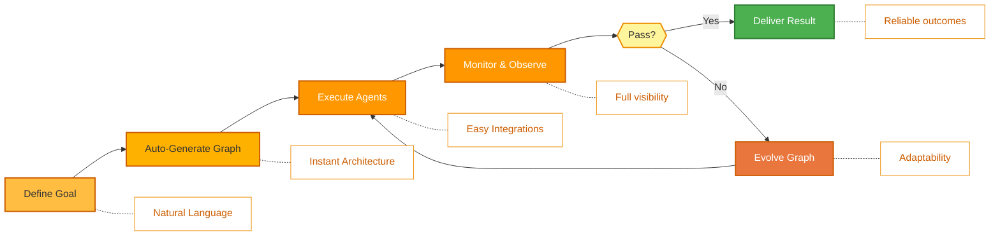
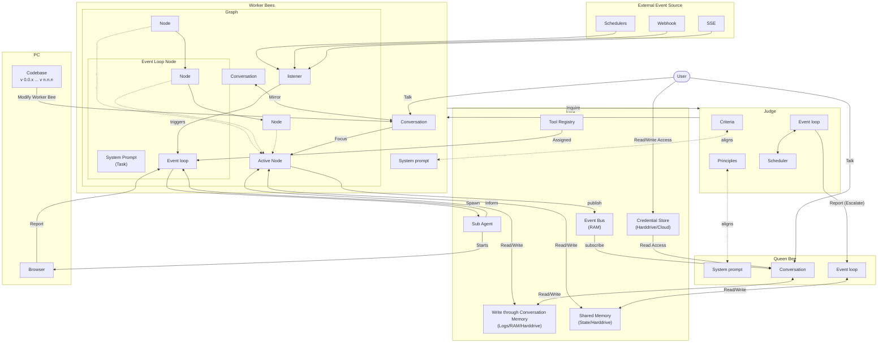

<p align="center">
  
</p>

<p align="center">
  <a href="README.md">English</a> |
  <a href="docs/i18n/zh-CN.md">简体中文</a> |
  <a href="docs/i18n/es.md">Español</a> |
  <a href="docs/i18n/hi.md">हिन्दी</a> |
  <a href="docs/i18n/pt.md">Português</a> |
  <a href="docs/i18n/ja.md">日本語</a> |
  <a href="docs/i18n/ru.md">Русский</a> |
  <a href="docs/i18n/ko.md">한국어</a>
</p>

<p align="center">
  <a href="https://github.com/aden-hive/hive/blob/main/LICENSE"></a>
  <a href="https://www.ycombinator.com/companies/aden"></a>
  <a href="https://discord.com/invite/MXE49hrKDk"></a>
  <a href="https://x.com/aden_hq"></a>
  <a href="https://www.linkedin.com/company/teamaden/"></a>
  
</p>

<p align="center">
  
  
  
  
  
</p>
<p align="center">
  
  
  
</p>

## Overview

Generate a swarm of worker agents with a coding agent(queen) that control them. Define your goal through conversation with hive queen, and the framework generates a node graph with dynamically created connection code. When things break, the framework captures failure data, evolves the agent through the coding agent, and redeploys. Built-in human-in-the-loop nodes, browser use, credential management, and real-time monitoring give you control without sacrificing adaptability.

Visit [adenhq.com](https://adenhq.com) for complete documentation, examples, and guides.


https://github.com/user-attachments/assets/bf10edc3-06ba-48b6-98ba-d069b15fb69d


## Who Is Hive For?

Hive is designed for developers and teams who want to build many **autonomous AI agents** fast without manually wiring complex workflows.

Hive is a good fit if you:

- Want AI agents that **execute real business processes**, not demos
- Need **fast or high volume agent execution** over open workflow
- Need **self-healing and adaptive agents** that improve over time
- Require **human-in-the-loop control**, observability, and cost limits
- Plan to run agents in **production environments**

Hive may not be the best fit if you’re only experimenting with simple agent chains or one-off scripts.

## When Should You Use Hive?

Use Hive when you need:

- Long-running, autonomous agents
- Strong guardrails, process, and controls
- Continuous improvement based on failures
- Multi-agent coordination
- A framework that evolves with your goals

## Quick Links

- **[Documentation](https://docs.adenhq.com/)** - Complete guides and API reference
- **[Self-Hosting Guide](https://docs.adenhq.com/getting-started/quickstart)** - Deploy Hive on your infrastructure
- **[Changelog](https://github.com/aden-hive/hive/releases)** - Latest updates and releases
- **[Roadmap](docs/roadmap.md)** - Upcoming features and plans
- **[Report Issues](https://github.com/aden-hive/hive/issues)** - Bug reports and feature requests
- **[Contributing](CONTRIBUTING.md)** - How to contribute and submit PRs

## Quick Start

### Prerequisites

- Python 3.11+ for agent development
- An LLM provider that powers the agents
- **ripgrep (optional, recommended on Windows):** The `search_files` tool uses ripgrep for faster file search. If not installed, a Python fallback is used. On Windows: `winget install BurntSushi.ripgrep` or `scoop install ripgrep`

> **Windows Users:** Native Windows is supported via `quickstart.ps1` and `hive.ps1`. Run these in PowerShell 5.1+. WSL is also an option but not required.

### Installation

> **Note**
> Hive uses a `uv` workspace layout and is not installed with `pip install`.
> Running `pip install -e .` from the repository root will create a placeholder package and Hive will not function correctly.
> Please use the quickstart script below to set up the environment.

```bash
# Clone the repository
git clone https://github.com/aden-hive/hive.git
cd hive

# Run quickstart setup (macOS/Linux)
./quickstart.sh

# Windows (PowerShell)
.\quickstart.ps1
```

This sets up:

- **framework** - Core agent runtime and graph executor (in `core/.venv`)
- **aden_tools** - MCP tools for agent capabilities (in `tools/.venv`)
- **credential store** - Encrypted API key storage (`~/.hive/credentials`)
- **LLM provider** - Interactive default model configuration, including Hive LLM and OpenRouter
- All required Python dependencies with `uv`

- Finally, it will open the Hive interface in your browser

> **Tip:** To reopen the dashboard later, run `hive open` from the project directory.

### Build Your First Agent

Type the agent you want to build in the home input box. The queen is going to ask you questions and work out a solution with you.


### Use Template Agents

Click "Try a sample agent" and check the templates. You can run a template directly or choose to build your version on top of the existing template.

### Run Agents

Now you can run an agent by selecting the agent (either an existing agent or example agent). You can click the Run button on the top left, or talk to the queen agent and it can run the agent for you.


## Features

- **Browser-Use** - Control the browser on your computer to achieve hard tasks
- **Parallel Execution** - Execute the generated graph in parallel. This way you can have multiple agents completing the jobs for you
- **[Goal-Driven Generation](docs/key_concepts/goals_outcome.md)** - Define objectives in natural language; the coding agent generates the agent graph and connection code to achieve them
- **[Adaptiveness](docs/key_concepts/evolution.md)** - Framework captures failures, calibrates according to the objectives, and evolves the agent graph
- **[Dynamic Node Connections](docs/key_concepts/graph.md)** - No predefined edges; connection code is generated by any capable LLM based on your goals
- **SDK-Wrapped Nodes** - Every node gets shared memory, local RLM memory, monitoring, tools, and LLM access out of the box
- **[Human-in-the-Loop](docs/key_concepts/graph.md#human-in-the-loop)** - Intervention nodes that pause execution for human input with configurable timeouts and escalation
- **Real-time Observability** - WebSocket streaming for live monitoring of agent execution, decisions, and node-to-node communication

## Integration

<a href="https://github.com/aden-hive/hive/tree/main/tools/src/aden_tools/tools"></a>
Hive is built to be model-agnostic and system-agnostic.

- **LLM flexibility** - Hive Framework supports Anthropic, OpenAI, OpenRouter, Hive LLM, and other hosted or local models through LiteLLM-compatible providers.
- **Business system connectivity** - Hive Framework is designed to connect to all kinds of business systems as tools, such as CRM, support, messaging, data, file, and internal APIs via MCP.

## Why Aden

Hive focuses on generating agents that run real business processes rather than generic agents. Instead of requiring you to manually design workflows, define agent interactions, and handle failures reactively, Hive flips the paradigm: **you describe outcomes, and the system builds itself**—delivering an outcome-driven, adaptive experience with an easy-to-use set of tools and integrations.



### The Hive Advantage

| Traditional Frameworks     | Hive                                   |
| -------------------------- | -------------------------------------- |
| Hardcode agent workflows   | Describe goals in natural language     |
| Manual graph definition    | Auto-generated agent graphs            |
| Reactive error handling    | Outcome-evaluation and adaptiveness    |
| Static tool configurations | Dynamic SDK-wrapped nodes              |
| Separate monitoring setup  | Built-in real-time observability       |
| DIY budget management      | Integrated cost controls & degradation |

### How It Works

1. **[Define Your Goal](docs/key_concepts/goals_outcome.md)** → Describe what you want to achieve in plain English
2. **Coding Agent Generates** → Creates the [agent graph](docs/key_concepts/graph.md), connection code, and test cases
3. **[Workers Execute](docs/key_concepts/worker_agent.md)** → SDK-wrapped nodes run with full observability and tool access
4. **Control Plane Monitors** → Real-time metrics, budget enforcement, policy management
5. **[Adaptiveness](docs/key_concepts/evolution.md)** → On failure, the system evolves the graph and redeploys automatically

## Documentation

- **[Developer Guide](docs/developer-guide.md)** - Comprehensive guide for developers
- [Getting Started](docs/getting-started.md) - Quick setup instructions
- [Configuration Guide](docs/configuration.md) - All configuration options
- [Architecture Overview](docs/architecture/README.md) - System design and structure

## Roadmap

Aden Hive Agent Framework aims to help developers build outcome-oriented, self-adaptive agents. See [roadmap.md](docs/roadmap.md) for details.



## Contributing
We welcome contributions from the community! We’re especially looking for help building tools, integrations, and example agents for the framework ([check #2805](https://github.com/aden-hive/hive/issues/2805)). If you’re interested in extending its functionality, this is the perfect place to start. Please see [CONTRIBUTING.md](CONTRIBUTING.md) for guidelines.

**Important:** Please get assigned to an issue before submitting a PR. Comment on an issue to claim it, and a maintainer will assign you. Issues with reproducible steps and proposals are prioritized. This helps prevent duplicate work.

1. Find or create an issue and get assigned
2. Fork the repository
3. Create your feature branch (`git checkout -b feature/amazing-feature`)
4. Commit your changes (`git commit -m 'Add amazing feature'`)
5. Push to the branch (`git push origin feature/amazing-feature`)
6. Open a Pull Request

## Community & Support

We use [Discord](https://discord.com/invite/MXE49hrKDk) for support, feature requests, and community discussions.

- Discord - [Join our community](https://discord.com/invite/MXE49hrKDk)
- Twitter/X - [@adenhq](https://x.com/aden_hq)
- LinkedIn - [Company Page](https://www.linkedin.com/company/teamaden/)

## Join Our Team

**We're hiring!** Join us in engineering, research, and go-to-market roles.

[View Open Positions](https://jobs.adenhq.com/a8cec478-cdbc-473c-bbd4-f4b7027ec193/applicant)

## Security

For security concerns, please see [SECURITY.md](SECURITY.md).

## License

This project is licensed under the Apache License 2.0 - see the [LICENSE](LICENSE) file for details.

## Frequently Asked Questions (FAQ)

**Q: What LLM providers does Hive support?**

Hive supports 100+ LLM providers through LiteLLM integration, including OpenAI (GPT-4, GPT-4o), Anthropic (Claude models), Google Gemini, DeepSeek, Mistral, Groq, OpenRouter, and Hive LLM. Simply set the appropriate API key environment variable and specify the model name. See [docs/configuration.md](docs/configuration.md) for provider-specific configuration examples.

**Q: Can I use Hive with local AI models like Ollama?**

Yes! Hive supports local models through LiteLLM. Simply use the model name format `ollama/model-name` (e.g., `ollama/llama3`, `ollama/mistral`) and ensure Ollama is running locally.

**Q: What makes Hive different from other agent frameworks?**

Hive generates your entire agent system from natural language goals using a coding agent—you don't hardcode workflows or manually define graphs. When agents fail, the framework automatically captures failure data, [evolves the agent graph](docs/key_concepts/evolution.md), and redeploys. This self-improving loop is unique to Aden.

**Q: Is Hive open-source?**

Yes, Hive is fully open-source under the Apache License 2.0. We actively encourage community contributions and collaboration.

**Q: Does Hive support human-in-the-loop workflows?**

Yes, Hive fully supports [human-in-the-loop](docs/key_concepts/graph.md#human-in-the-loop) workflows through intervention nodes that pause execution for human input. These include configurable timeouts and escalation policies, allowing seamless collaboration between human experts and AI agents.

**Q: What programming languages does Hive support?**

The Hive framework is built in Python. A JavaScript/TypeScript SDK is on the roadmap.

**Q: Can Hive agents interact with external tools and APIs?**

Yes. Aden's SDK-wrapped nodes provide built-in tool access, and the framework supports flexible tool ecosystems. Agents can integrate with external APIs, databases, and services through the node architecture.

**Q: How does cost control work in Hive?**

Hive provides granular budget controls including spending limits, throttles, and automatic model degradation policies. You can set budgets at the team, agent, or workflow level, with real-time cost tracking and alerts.

**Q: Where can I find examples and documentation?**

Visit [docs.adenhq.com](https://docs.adenhq.com/) for complete guides, API reference, and getting started tutorials. The repository also includes documentation in the `docs/` folder and a comprehensive [developer guide](docs/developer-guide.md).

**Q: How can I contribute to Aden?**

Contributions are welcome! Fork the repository, create your feature branch, implement your changes, and submit a pull request. See [CONTRIBUTING.md](CONTRIBUTING.md) for detailed guidelines.

## Star History

<a href="https://star-history.com/#aden-hive/hive&Date">
 <picture>
   <source media="(prefers-color-scheme: dark)" srcset="https://api.star-history.com/svg?repos=aden-hive/hive&type=Date&theme=dark" />
   <source media="(prefers-color-scheme: light)" srcset="https://api.star-history.com/svg?repos=aden-hive/hive&type=Date" />
   
 </picture>
</a>

---

<p align="center">
  Made with 🔥 Passion in San Francisco
</p>
