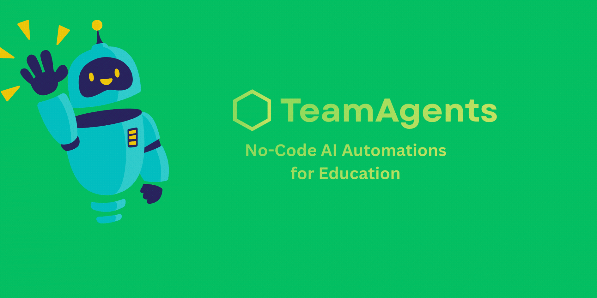
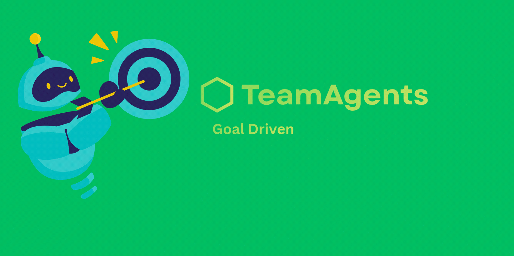
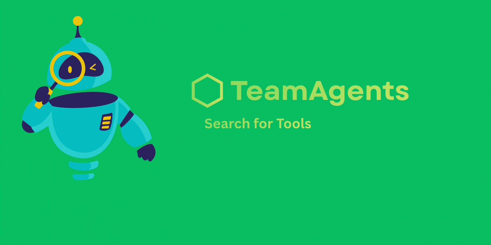
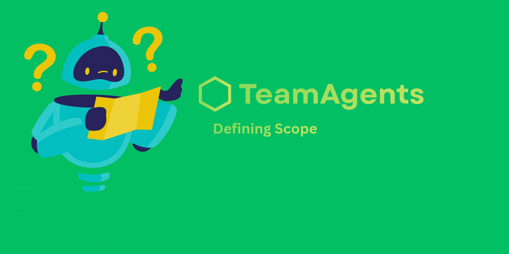
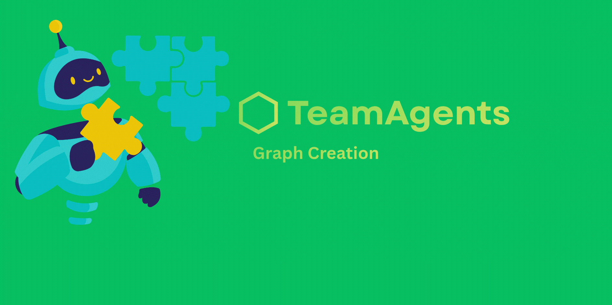
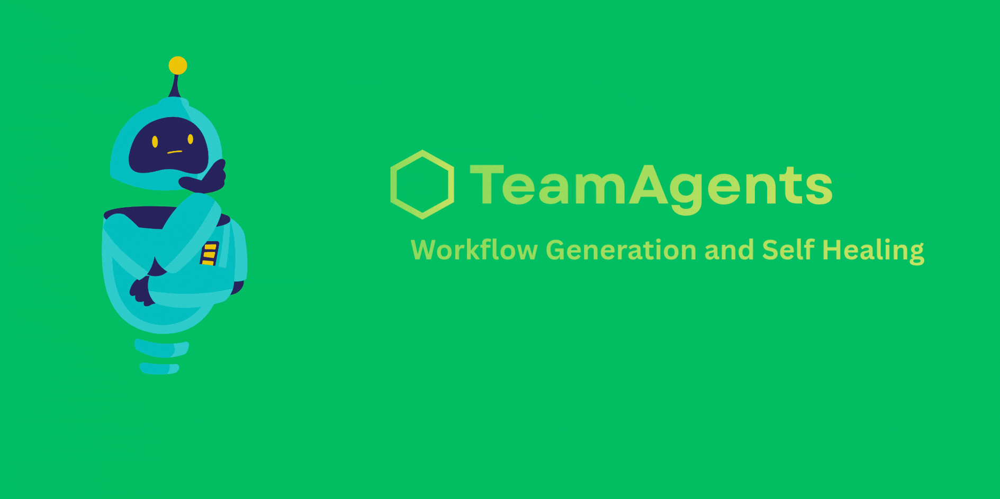

# TeamAgents: Education Automation Framework



Welcome to the **TeamAgents Education Automation Framework**. This project is a specialized, multi-agent AI system built specifically to streamline, automate, and orchestrate workflows within the education sector. 

Whether you are a student managing coursework, a teacher organizing class materials, or school administration handling logistics, this framework empowers you to build AI-driven "worker agents" that automate your daily tasks.

At the core of the framework is the **Master Agent**—your primary interface and AI orchestrator. You converse with the Master Agent in plain English, and it designs, codes, and deploys specialized worker agents on your behalf.

---

## 🌟 What We Are Trying To Do


Our overarching goal is to **reduce administrative and repetitive friction in education** using advanced AI automation. 

Instead of manually checking emails, cross-referencing calendars, scraping research papers, or summarizing Zoom transcripts, you simply ask the Master Agent to build a workflow for you. 

### Target Audiences & Use Cases:
- **For Students:** Automate research gathering from arXiv and Wikipedia, sync assignment deadlines to Google Calendar, summarize YouTube lecture transcripts, and parse thick PDF textbooks into Notion or Obsidian study notes.
- **For Teachers:** Automate the distribution of Google Docs, mass-email students via Gmail integrations, grade/parse CSV files and Google Sheets, and send announcements to Discord or Telegram.
- **For Administration:** Generate daily risk/security reports, monitor network metrics, track attendance records, and orchestrate complex scheduling conflicts automatically.

---

## 🛠️ Education-Specific Tooling


Unlike generalized AI frameworks, TeamAgents has been heavily pruned and optimized exclusively for the educational domain. The Master Agent has native access to the following integrations:
- **Google Workspace:** Docs, Sheets, Gmail, Calendar, Drive.
- **Communication:** Discord, Telegram, Pushover, Email.
- **Research & Data:** arXiv, Wikipedia, DuckDuckGo, WebSearch, WebScrape, PDFRead, CSV, Excel.
- **Knowledge Management:** Notion, Obsidian.
- **Media & Lectures:** YouTube, YouTube Transcripts, Zoom.
- **Utilities:** Time, File System, HTTP Headers, DNS Security, Risk Scorer, Vision, HuggingFace.

---

## 🚀 Getting Started


### Prerequisites
- **Operating System:** Windows (The setup currently utilizes PowerShell scripts).
- **Python:** Python 3.10 or higher.
- **Node.js:** Node.js v20+ (Only required for the UI dashboard; the script will attempt to install this for you if missing).
- **LLM API Key:** You will need an API key from **Groq**, **Google Gemini**, or **OpenRouter**. 

### Installation & Launch

1. **Clone the repository** and navigate to the project folder.
2. **Run the setup script** in your PowerShell terminal:
   ```powershell
   .\quickstart.ps1
   ```
3. **Follow the Setup Wizard:**
   - The script will automatically install necessary dependencies using `uv` (a fast Python package manager) and build the React dashboard.
   - It will prompt you to select your preferred AI provider (`Gemini`, `Groq`, `OpenRouter`, or `Ollama`).
   - *Note on Local Models (Ollama):* If you have a highly capable PC, you can use Ollama as your required integration to run models completely offline. However, the Master Agent utilizes an extremely complex, 60,000+ character system prompt to orchestrate its 30+ tools. **You must use a highly capable model (32B to 70B+ parameters) that natively supports tool calling and has at least a 128k token context length (e.g., `qwen2.5:32b` or `llama3.1:70b`)**. Smaller models (7B/8B), models without tool calling support, or models with small context windows will easily hallucinate and fail to format their internal tool-calling properly.

4. **Access the Dashboard:**
   Once setup is complete, the framework will serve a local API and launch the dashboard in your browser.
   - Dashboard: `http://127.0.0.1:8787`

### Interacting with the Master Agent


Once in the dashboard, simply describe your problem.
*Example Prompt:*
> "I need a worker agent that runs every Friday at 5 PM. It should check my Gmail for any emails labeled 'Assignment', extract the attached PDFs, summarize them, and append the summary to my Google Sheet."

The Master Agent will plan the architecture, request any missing API credentials from you, write the code for the worker agent, and deploy it to your local environment.

### 👷 Worker & Junior Agents


While the **Master Agent** serves as the highly-capable orchestrator and designer, the actual execution of tasks is delegated to **Worker Agents** (or Junior Agents). 
- **Worker Agents** are specialized, lightweight AI scripts built by the Master Agent to perform one specific workflow (e.g., "The PDF Summarizer Agent" or "The Discord Announcement Agent").
- Once built, these agents run entirely independently in the background. They can be scheduled to run on cron jobs (like every Friday), or triggered by external webhooks.
- Because they perform narrow, focused tasks, Worker Agents do not require massive LLMs. They can run efficiently on smaller, faster models (like Gemini Flash, Groq, or local 7B-8B models) to save costs and compute resources while the Master Agent focuses on higher-level orchestration.

---

## 🧠 System Architecture


- **Frontend:** React + Vite dashboard for real-time agent chatting and workflow visualization.
- **Backend:** Python + FastAPI framework managing SSE (Server-Sent Events) and async background agents.
- **LLM Routing:** Powered by `litellm` for dynamic, standardized API requests across Google, Groq, and OpenRouter.
- **Credential Storage:** Local, encrypted credential store (`~/.teamagents/credentials`) to safely store your OAuth tokens and API keys.

### 🔄 Self-Healing & Iterative Execution
A core strength of the TeamAgents framework is its built-in resilience. If a worker agent encounters an error, throws an exception, or fails to execute a tool properly:
- The system catches the failure and passes the error stack trace back to the Master Agent.
- The Master Agent analyzes the failure, **reiterates** its plan, rewrites the faulty code, and attempts to run it again.
- This continuous feedback loop ensures that the framework dynamically adapts and builds a robust, fault-tolerant workflow without requiring you to manually debug the code.

Enjoy automating your educational workflows! 🎒✨
